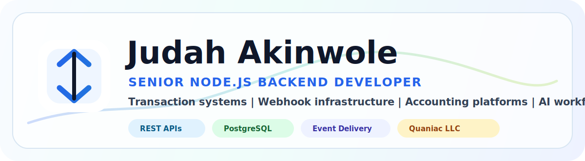

 

 

  <table>
    <tr>
      <td align="center" width="20%">
        <strong>Role</strong> 
        Senior Node.js Backend
      </td>
      <td align="center" width="20%">
        <strong>Company</strong> 
        Quaniac LLC
      </td>
      <td align="center" width="20%">
        <strong>Domains</strong> 
        Accounting, Legal AI, Fintech
      </td>
      <td align="center" width="20%">
        <strong>Backend Proof</strong> 
        Auth, SQL, Reports, AI Context
      </td>
      <td align="center" width="20%">
        <strong>Direction</strong> 
        Senior Backend Roles
      </td>
    </tr>
  </table>

## About

I build backend systems that go beyond simple CRUD: authentication, domain modeling, financial workflows, AI-assisted products, report generation, operational visibility, and APIs structured enough for real product teams to maintain.

My strongest work sits at the intersection of backend engineering and business-critical workflows: accounting/tax, legal AI, education platforms, analytics systems, and fintech-style transaction processing.

## Core Stack

  
  
  
  
  
  
  
  
  
  

## Featured Systems

<table>
  <tr>
    <td width="50%" valign="top">
      <h3>RUBRIC3</h3>
      
<strong>Smart accounting and Nigerian tax platform.</strong>

      
Node.js/Express backend plus React/TypeScript dashboard for income and expense tracking, tax calculations, AI accounting assistance, and financial report exports.

      

        
        
        
      

    </td>
    <td width="50%" valign="top">
      <h3>TradeSync Lite</h3>
      
<strong>Transaction-processing backend system.</strong>

      
Fintech-style lifecycle simulation for trade requests, background processing, payout attempts, retries, status transitions, logs, and operational monitoring.

      

        
        
        
      

    </td>
  </tr>
  <tr>
    <td width="50%" valign="top">
      <h3>Estoppel</h3>
      
<strong>Legal AI workspace.</strong>

      
React frontend and Django REST backend for legal projects, notes, uploaded document context, streaming AI chat, legal prompt orchestration, and document exports.

      

        
        
        
      

    </td>
    <td width="50%" valign="top">
      <h3>AidLearn Analytics</h3>
      
<strong>Analytics learning platform.</strong>

      
Large React/TypeScript platform with role-based dashboards, course workflows, practical labs, business/team learning, admin tools, tutor consoles, and analytics views.

      

        
        
        
      

    </td>
  </tr>
</table>

## Repository Blocks

<table>
  <tr>
    <td width="50%" valign="top">
      <h3><a href="https://github.com/judahel2025/RUBRIC-3">RUBRIC3 Frontend</a></h3>
      
React/TypeScript dashboard for accounting, tax summaries, reports, transactions, settings, and AI assistant workflows.

      

        
        
        
      

    </td>
    <td width="50%" valign="top">
      <h3><a href="https://github.com/judahel2025/The-RUBRIC-BACKEND">RUBRIC3 Backend</a></h3>
      
Node.js/Express API for auth, transactions, profile isolation, Nigerian tax calculations, AI accounting guidance, and report exports.

      

        
        
        
      

    </td>
  </tr>
  <tr>
    <td width="50%" valign="top">
      <h3><a href="https://github.com/judahel2025/THE-ESTOPEL-PROJECT">Estoppel Frontend</a></h3>
      
React legal AI workspace for projects, chats, onboarding, notes, instructions, markdown responses, and model selection.

      

        
        
        
      

    </td>
    <td width="50%" valign="top">
      <h3><a href="https://github.com/judahel2025/THE-ESTOPEL-PROJECT-BACKEND">Estoppel Backend</a></h3>
      
Django REST backend for legal projects, JWT auth, notes, documents, AI prompt orchestration, streaming chat, and exports.

      

        
        
        
      

    </td>
  </tr>
  <tr>
    <td width="50%" valign="top">
      <h3><a href="https://github.com/aidlearnanalytics/aidlearnanalytics">AidLearn Analytics</a></h3>
      
React/TypeScript learning platform with student dashboards, business/team workflows, admin tools, tutor consoles, labs, and analytics.

      

        
        
        
      

    </td>
    <td width="50%" valign="top">
      <h3>TradeSync Lite</h3>
      
Transaction-processing backend in progress for async trade lifecycle handling, payout simulation, retries, logs, and dashboard visibility.

      

        
        
        
      

    </td>
  </tr>
</table>

## Engineering Signals

| Signal | How It Shows Up In My Work |
| --- | --- |
| API design | Authenticated REST APIs, route/controller/service separation, middleware boundaries |
| Data ownership | User/profile ownership checks before financial, project, or chat data is returned |
| Domain logic | Tax engines, transaction flows, report data, legal project context, learning workflows |
| AI integration | Domain-specific prompts, structured context injection, streaming responses, AI summaries |
| Operational thinking | Reports, histories, logs, dashboard summaries, health checks, status tracking |
| Portfolio readiness | Each serious repo has a README that explains architecture and product purpose |

## GitHub Dashboard

 

 

## Contribution Graph

<picture>
  <source media="(prefers-color-scheme: dark)" srcset="https://raw.githubusercontent.com/judahel2025/judahel2025/output/github-snake-dark.svg" />
  <source media="(prefers-color-scheme: light)" srcset="https://raw.githubusercontent.com/judahel2025/judahel2025/output/github-snake.svg" />
  
</picture>

## Current Direction

I am focused on senior Node.js backend roles involving REST API architecture, financial and transaction workflows, database modeling, authentication and authorization, async processing, retry systems, AI-assisted product architecture, operational dashboards, and reporting.

## Contact

  
  

